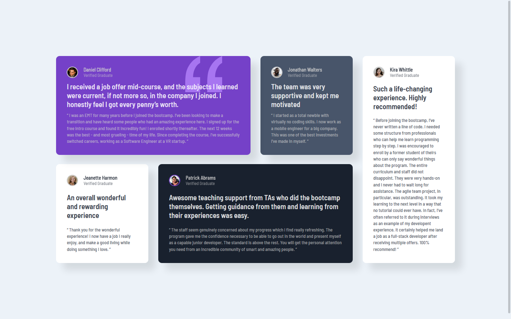

# Frontend Mentor - Testimonials grid section solution

This is a solution to the [Testimonials grid section challenge on Frontend Mentor](https://www.frontendmentor.io/challenges/testimonials-grid-section-Nnw6J7Un7). Frontend Mentor challenges help you improve your coding skills by building realistic projects.

## Table of contents

-   [Overview](#overview)
    -   [The challenge](#the-challenge)
    -   [Screenshot](#screenshot)
    -   [Links](#links)
-   [My process](#my-process)
    -   [Built with](#built-with)
    -   [What I learned](#what-i-learned)
    -   [Continued development](#continued-development)
    -   [Useful resources](#useful-resources)
-   [Author](#author)

## Overview

### The challenge

Users should be able to:

-   View the optimal layout for the site depending on their device's screen size

### Screenshot

### Links

-   Solution URL: 
-   Live Site URL: 

## My process

### Built with

-   Semantic HTML5 markup
-   CSS variables
-   Flexbox
-   CSS Grid

### What I learned

I learned about flex grid, and how to use grid-template-areas to easily create a layout.

### Continued development

I'm stil not completely familiar with responsive design best practices.

### Useful resources

-   [Youtube](https://www.youtube.com/watch?v=68O6eOGAGqA&ab_channel=AngelaDelise) - This helped me with the grid layout.
-   [CSS Tricks](https://css-tricks.com/snippets/css/a-guide-to-flexbox/) - This helped me with flex grid.

## Author

-   Website - [Github](https://github.com/kyle4real)
-   Frontend Mentor - [@kyle4real](https://www.frontendmentor.io/profile/kyle4real)
